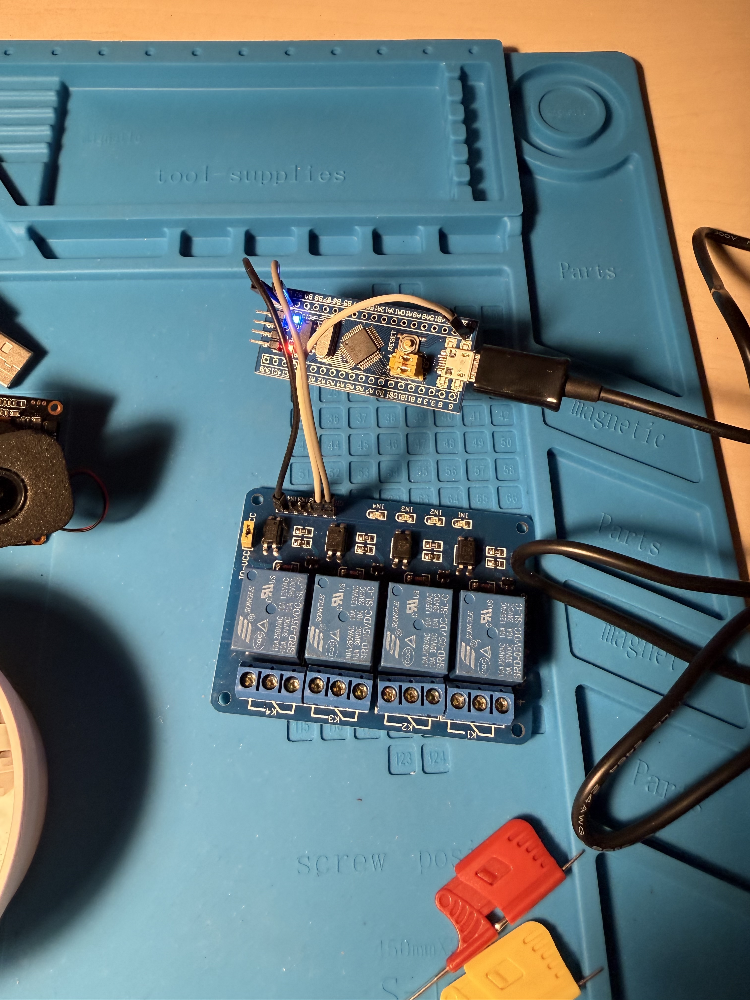

# usb-relay-stm32

USB relay firmware for STM32 boards that exposes a simple serial command interface over USB CDC-ACM.




## What You Can Do With It
- Control up to 8 relay outputs from a host computer over USB serial.
- Turn relays on/off, toggle, pulse for a duration, or set all channels with a bitmask.
- Identify devices by unique STM32-based serial number.
- Reboot directly into STM32 ROM DFU mode from software.

## Supported Devices
This firmware currently targets three STM32 board families (default TinyUSB board in parentheses):
- `STM32F0` (`stm32f072disco`)
- `STM32F1` (`stm32f103_bluepill`)
- `STM32F4` (`stm32f411blackpill`)

Hardware behavior is family-port specific (GPIO mapping, relay polarity, UID base, DFU ROM address).

## Relay GPIO Wiring
Connect each USB relay module input (`IN1..IN8`) to the corresponding STM32 GPIO below, and connect grounds together.

- `STM32F0` (`stm32f072disco`): `IN1=PA0`, `IN2=PA1`, `IN3=PA2`, `IN4=PA3`, `IN5=PA4`, `IN6=PA5`, `IN7=PA6`, `IN8=PA7`
- `STM32F1` (`stm32f103_bluepill`): `IN1=PB12`, `IN2=PB13`, `IN3=PB14`, `IN4=PB15`, `IN5=PB8`, `IN6=PB9`, `IN7=PB10`, `IN8=PB11` (active-low outputs)
- `STM32F4` (`stm32f411blackpill`): `IN1=PB0`, `IN2=PB1`, `IN3=PB2`, `IN4=PB10`, `IN5=PB3`, `IN6=PB4`, `IN7=PB5`, `IN8=PB7`

## Quick Start
1. Build firmware for your board family.
2. Flash with ST-Link or J-Link.
3. Connect over USB CDC serial from your host.
4. Send line-based commands and parse machine-readable responses.

## How To Use The Firmware
After USB enumeration, open the device serial port (for example with `picocom`, `minicom`, or `screen`) and send one command per line.

Examples:
```text
help
id
version
state
set 1 on
set 1 off
toggle 1
pulse 1 1000
setmask 0xff
all off
reboot-dfu
```

Typical responses:
```text
OK
ERR invalid-relay
ERR invalid-arg
STATE 0x03
ID 045101780587252555FFC660
VERSION usb-relay-stm32 0.1.0
UPTIME 12345
```

Notes:
- Relay indices are `1..N` where `N` is board-configured (up to 8).
- Commands are line-oriented (`\n` or `\r\n`).
- On USB mount, firmware emits `OK`.

## Build
### Prerequisites
- ARM GCC toolchain
- CMake `3.20+`
- Python 3
- TinyUSB checkout at `tinyusb` (or vendored in `firmware/tinyusb`)

### Fetch TinyUSB + STM32 deps
```bash
cd firmware
git clone https://github.com/hathach/tinyusb.git ../tinyusb
python3 ../tinyusb/tools/get_deps.py stm32f0 stm32f1 stm32f4
```

### Configure + build
```bash
cmake -S firmware -B build-f0 -DBOARD_FAMILY=STM32F0
cmake --build build-f0

cmake -S firmware -B build-f1 -DBOARD_FAMILY=STM32F1
cmake --build build-f1

cmake -S firmware -B build-f4 -DBOARD_FAMILY=STM32F4
cmake --build build-f4
```

Output artifacts include `.elf`, `.bin`, `.hex` in the selected build directory.

## Flash To Device
Use TinyUSB family flash targets after configure/build.

### ST-Link
```bash
cmake --build build-f0 --target usb-relay-stm32-stlink
cmake --build build-f1 --target usb-relay-stm32-stlink
cmake --build build-f4 --target usb-relay-stm32-stlink
```

### ST-Link (direct tool, flash `.bin`)
If you prefer flashing directly (without CMake flash targets), use STM32CubeProgrammer CLI.
This works on both macOS and Linux.

```bash
# STM32F0 build output
STM32_Programmer_CLI --connect port=swd \
  --write build-f0/usb-relay-stm32.bin 0x08000000 \
  --verify --go

# STM32F1 build output
STM32_Programmer_CLI --connect port=swd \
  --write build-f1/usb-relay-stm32.bin 0x08000000 \
  --verify --go

# STM32F4 build output
STM32_Programmer_CLI --connect port=swd \
  --write build-f4/usb-relay-stm32.bin 0x08000000 \
  --verify --go
```

Optional alternative with `st-flash` (from `stlink`):
```bash
st-flash --reset write build-f0/usb-relay-stm32.bin 0x08000000
st-flash --reset write build-f1/usb-relay-stm32.bin 0x08000000
st-flash --reset write build-f4/usb-relay-stm32.bin 0x08000000
```

### J-Link
```bash
cmake --build build-f0 --target usb-relay-stm32-jlink
cmake --build build-f1 --target usb-relay-stm32-jlink
cmake --build build-f4 --target usb-relay-stm32-jlink
```

## Linux Non-Root Access (udev)
This repo includes a udev rule for VID:PID `cafe:4010`.

Install:
```bash
./udev/install-udev-rules.sh
```

If you change USB VID/PID in `firmware/src/usb_descriptors.c`, update `udev/99-usb-relay-stm32.rules` accordingly.

## Internal Implementation Details
- TinyUSB device stack with CDC-ACM transport.
- Line-based command parser with machine-readable status/error responses.
- USB serial descriptor string is generated from STM32 96-bit unique ID.
- Relay ports are split by family:
  - `firmware/boards/ports/port_stm32f0.c`
  - `firmware/boards/ports/port_stm32f1.c`
  - `firmware/boards/ports/port_stm32f4.c`
- `reboot-dfu` jumps to STM32 system-memory DFU ROM entry point for the active family port.
